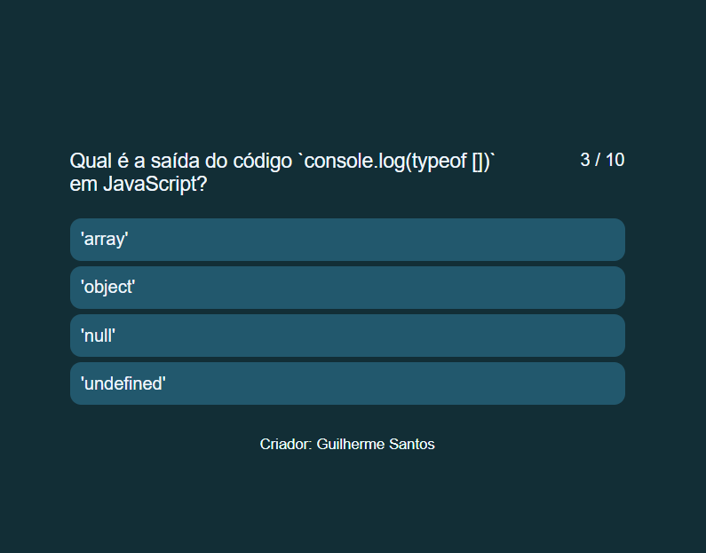
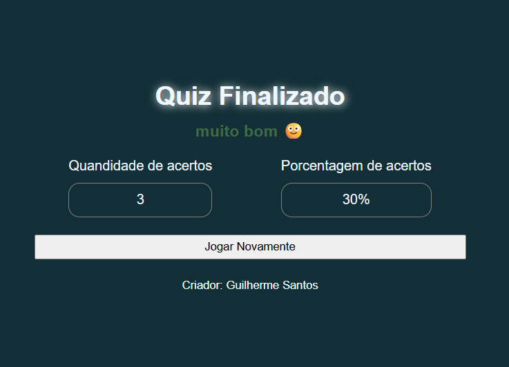
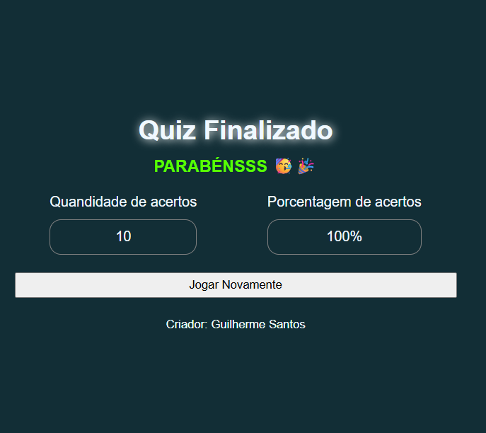

# Quiz Interativo de JavaScript

## ✅ Descrição do Projeto

Este projeto é um **quiz interativo** desenvolvido com **HTML**, **CSS**, e **JavaScript** puro. A **base do projeto foi adaptada e um pouco modificada** de um quiz da **B7Web**, onde adicionei e apliquei meus próprios conhecimentos para expandir meus estudos. O objetivo é testar os conhecimentos dos usuários sobre JavaScript, apresentando perguntas de múltipla escolha e fornecendo feedback instantâneo para um aprendizado eficaz.

🔗 Acesse o projeto online:  
https://guiihsantos.github.io/Quiz_JavaScript/

## Funcionalidades do Projeto

- **Exibição de Perguntas Dinâmicas**: Apresenta perguntas de JavaScript de forma sequencial.
- **Múltipla Escolha**: Permite que o usuário selecione uma das opções fornecidas para cada pergunta.
- **Contagem de Perguntas**: Exibe o progresso do quiz (ex: 1/10).
- **Resultado Final**: Ao concluir o quiz, mostra a quantidade de acertos e a porcentagem de acertos.
- **Mensagem Personalizada**: Oferece uma mensagem personalizada ao final do quiz com base na porcentagem de acertos.
- **Opção de Reiniciar**: Permite que o usuário jogue novamente o quiz.

## 💻 Testes de Software

Os testes realizados durante o desenvolvimento incluem:

- **Teste de Funcionamento**:
  - Validação da exibição correta das perguntas e opções.
  - Verificação da lógica de acerto e erro ao selecionar as opções.
  - Confirmação de que a contagem de perguntas e o progresso estão sendo atualizados corretamente.
  - Teste do cálculo e exibição da pontuação final (quantidade e porcentagem de acertos).
  - Verificação da funcionalidade do botão "Jogar Novamente", resetando o quiz corretamente.
  - Confirmação de que as mensagens personalizadas são exibidas de acordo com a porcentagem de acertos.
- **Teste de Depuração**:
  - Correção de bugs relacionados à renderização das opções de resposta.
  - Ajustes na lógica de fluxo do quiz para garantir que todas as perguntas sejam exibidas antes da finalização.
  - Resolução de problemas de estilos CSS para garantir uma boa experiência visual.

## 🔨 Pré-requisitos e Instalação

Não são necessários pré-requisitos complexos ou instalações de pacotes. Basta um **navegador web moderno**.

Para rodar o projeto localmente:

1.  **Clone o repositório**:
    ```bash
    git clone https://github.com/GuiihSantos/Quiz_JavaScript.git
    ```
2.  **Navegue até o diretório do projeto**:
    ```bash
    cd Quiz_JavaScript
    ```
3.  **Abra o arquivo `index.html`**:
    Simplesmente clique duas vezes no arquivo `index.html` ou arraste-o para o seu navegador.

## 📦 Tecnologias e Linguagens

- **HTML5**: Estrutura da página web.
- **CSS3**: Estilização e layout da interface do usuário.
- **JavaScript (ES6+)**: Lógica de funcionamento do quiz, manipulação do DOM e gerenciamento do estado do jogo.

## ✅ Instruções de Uso

1.  Após abrir o arquivo `index.html` no seu navegador, a primeira pergunta do quiz será exibida.
2.  Leia a pergunta e clique em uma das opções para selecionar sua resposta.
3.  O quiz avançará automaticamente para a próxima pergunta após sua seleção.
4.  Ao final das 10 perguntas, a tela de resultados será exibida, mostrando sua pontuação e uma mensagem personalizada.
5.  Clique no botão "Jogar Novamente" para reiniciar o quiz.

## 📄 Documentação

- [MDN Web Docs - HTML](https://developer.mozilla.org/pt-BR/docs/Web/HTML)
- [MDN Web Docs - CSS](https://developer.mozilla.org/pt-BR/docs/Web/CSS)
- [MDN Web Docs - JavaScript](https://developer.mozilla.org/pt-BR/docs/Web/JavaScript)

## 🪪 Licença

Este projeto está licenciado sob a **Licença MIT**. Sinta-se à vontade para usar, modificar e distribuir este código para fins educacionais e não comerciais, desde que a atribuição original seja mantida.

## 📷 Imagens do projeto:

<div style="display: flex; justify-content: center; " >
  <div  align="center">
    
    
    
  </div>
</div>
